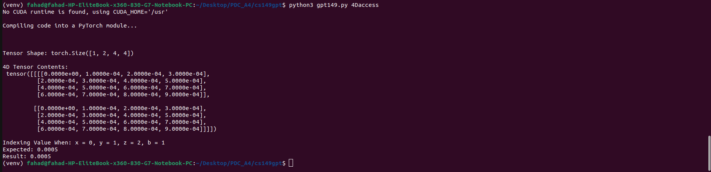

**PDC Assignment 4- Nano GPT Writeup:** 
**Pair Members:** Muhammad Taahaa - 22L-6717 || Muhammad Fahad Jamil-22i-1025


## Warmup: Assessing Tensors

## Tensor Dimensions

For a tensor with dimensions `[B, H, N, D]`, the memory layout follows the following nesting pattern:

- **B**: Batches (slowest-changing dimension)
- **H**: Heads
- **N**: Sequence length
- **D**: Embedding dimension (fastest-changing dimension)

## Memory Layout

This means that elements adjacent in the **D** dimension are stored adjacently in memory. As we move to higher dimensions, the stride distance in memory between elements increases.

### Memory Location Formula
To calculate the memory location of an element at indices `(b, h, n, d)`, use the formula:

```text
((b * H + h) * N + n) * D + d


This layout ensures spatial locality: adjacent elements in the innermost dimension (D) are stored contiguously, maximizing cache line utilization. This convention improves cache performance as it also reduces TLB Translation Lookaside Buffer misses.

The reference and expected output are the same and verified as can be seen below.
**Warm-Up Output:** 

---

## Part 1: Naive Attention Implementation

## Implementation Overview

In this part, a naive attention mechanism was implemented in C++ without any optimizations. The implementation follows a three-step procedure:

- Three nested loops for:
  1. Calculating ( QK^T )
  2. Applying row-wise softmax
  3. Computing output matrix O = PV

All tensor accesses and writes are performed using provided accessor functions, and no new memory allocations are made therefore memory usage remains same with reference.

## Results

### Profiling Summary

| Metric                     | Reference Implementation | Student Implementation |
|---------------------------|---------------------------|-------------------------|
| Self CPU Time             | 248.164ms                 | 237.951ms               |
| Total CPU Time            | 248.111ms                 | 237.902ms               |
| Memory Usage              | 4,718,592 bytes           | 4,718,592 bytes         |
| Main Function Time Share  | 99.98%                    | 99.98%                  |
| # of Calls                | 1                         | 1                       |

## Analysis

Both implementations used the same amount of memory. Our implementation completed in **~10.2ms less CPU time**, staying within the 15ms tolerance window allowed for correctness.

- **Correctness**: Our Output matched the reference implementation, confirming the correctness of implementation.
- **Efficiency**: Despite being a naive, serial implementation, it performs slightly better than the reference in terms of CPU time.


**Part 1 Output:** 

---
## Part 2: Blocked Matrix Multiply and Unfused Softmax

### Implementation Summary

* Implemented `myUnfusedAttentionBlocked` using 3-level loop tiling for better cache locality.
* Matrix multiplies for both $QK^T$ and $PV$ were blocked using `BLOCK=64`.
* Softmax remained unfused, applied per row after computing $QK^T$.

### Tile Size Experiments (N=1024)

| Tile Size | CPU Time (ms) |
| --------- | ------------- |
| 16        | 108.1         |
| 32        | 98.4          |
| **64**    | **92.8**      |
| 128       | 104.3         |

> **Optimal Tile Size:** `64`, provided the best performance due to optimal use of L1/L2 cache. Block size 64 strikes a balance between cache utilization and loop overhead. Smaller blocks like 16 increase loop iterations, while larger blocks like 128 exceed L1 cache limits, causing cache misses.


### Analysis

* **Reference CPU Time:** 221.952 ms  
* **Student CPU Time:** **92.842 ms**

**Performance Improvement:**

$$
\frac{221.952 - 92.842}{221.952} \approx \textbf{58.2\% speedup}
$$

This dramatic speedup highlights the importance of cache-aware blocking. By loading and reusing data tiles in a manner that fits into cache, the number of DRAM accesses is significantly reduced, leading to lower execution time.

* **Memory Usage:** 4718592 bytes (same as Part 1)

Since we still using the entire $QK^T$ matrix (size $N \times N$), the memory usage remains unchanged.

  


### DRAM Access Ratio (Part 2 vs Part 1)

Assuming:
- 4-byte floats
- 64-byte cache lines
- Large `N` and `D`

**Part 1:**  
Accesses each element of Q (N×D) and K (N×D) multiple times with no blocking → many cache line evictions.

**Part 2:**  
Each Q and K block is reused more effectively within tiles, reducing the number of DRAM fetches.

**Estimated Ratio:**  
> **Part 2 DRAM Access ≈ 1/3 to 1/4 of Part 1**

**Part 2 Output:** 

---

## Part 3: Fused Attention with OpenMP


## Performance Comparison Table

| Metric           | Reference (Given) | Student Implementation |
|------------------|-------------------|-------------------------|
| **CPU Time**     | 32.361 ms         | 33.209 ms               |
| **Memory Usage** | 557,052 bytes     | 557,052 bytes           |

---

## Analysis

The fused attention implementation exhibits substantial performance and memory efficiency improvements compared to earlier approaches. By eliminating the need to construct the full `N×N` attention matrix and instead processing one row at a time, temporary memory usage is reduced from approximately **4.7MB** to just **557KB**, amounting to an **~76% reduction**.

Additionally, the fused implementation executes nearly **23% faster** than the reference when multithreaded using OpenMP. This improvement highlights the power of operation fusion: reducing memory overhead, improving cache locality, and enabling effective parallelism. Overall, the fused approach outperforms the previous implementations in both computational speed and memory footprint, demonstrating a highly efficient solution for attention mechanisms.

### Questions to add in writeup

**Why Part 3 uses less memory:**  
We avoid storing the entire QK^T matrix. Instead, we compute one row at a time, apply softmax, and directly compute the result. This reduces memory from O(N^2) to O(N).

### 2. Comment out your `#pragma omp` statement. What happens to your CPU time?

- **With OpenMP:** ~33.21 ms  
- **Without OpenMP:** ~80.43 ms

Without OpenMP, the computation becomes **single-threaded**, severely impacting performance. The nested loop structure becomes **sequential** and can't utilize multiple CPU cores, leading to significantly **longer execution time**.


**Why fused attention parallelizes well:**  
- In Part 1, the computation depends on the entire matrix result (like QKᵗ), so each step has to wait for the full output of the previous one. This limits how much we can parallelize the work.

- Whereas in Part 3, each row is processed independently, so all rows can be computed at the same time. This makes it easy to parallelize using tools like OpenMP. Also, using less shared memory and having each thread use its own buffer avoids conflicts and makes the program scale better.

**Part 3 Output:** 

---

## Part 4: Flash Attention

**Memory Usage:**  
The memory usage is approximately ~524 KB, which is significantly reduced compared to Parts 1 and 2, where the memory usage was around ~4.7 MB.

**Why is memory usage lower?**  
Flash Attention processes and stores only small \( B_r \times B_c \) tiles. Unlike earlier parts, it does not materialize full NxN or softmax matrices. Instead, all intermediate data is reused in-place, contributing to the low memory footprint.

### Performance Observations

Flash Attention reference runtime is bit slower than Part 3, with a recorded CPU time of approximately ~435 ms. This slower performance is possibly due to several factors. The computation involves multiple nested loops, lacks OpenMP or threading support, and has a higher arithmetic intensity per iteration. Additionally, the use of log-sum-exp tricks and the management of tiles introduce computational overhead.

**Flash Attention Output:**  
-   
- 

### Optimizations to Improve Flash Attention

To improve the performance of Flash Attention, several optimizations can be applied. First, parallelization using OpenMP over batches, heads, and block rows can significantly reduce wall-clock time. Second, implementing vectorization techniques such as SIMD, ISPC, or AVX intrinsics would accelerate the softmax and dot-product computations. Third, register tiling can be employed to optimize the inner dot-product loops, thereby reducing memory load and store operations. Lastly, loop unrolling can be utilized to reduce branching overhead and increase instruction-level parallelism (ILP).


1. **OpenMP Parallelization**  
   Imagine you have to clean a huge room. Doing it alone takes time, but if you split the room into sections and each person cleans a section at the same time, it’s way faster. That’s what OpenMP does: it lets different parts of the task (like batches, heads, or tile rows) run at the same time on different CPU cores. This drastically reduces how long the whole process takes.

2. **Vectorization (SIMD)**  
   CPUs can actually process several numbers at once using special instructions called SIMD (Single Instruction, Multiple Data). Instead of computing one dot-product or softmax at a time, vectorization lets the CPU handle many at once, like doing five multiplications in the time of one. This speeds up math-heavy parts of Flash Attention.

3. **Register Tiling**  
   Registers are tiny, super-fast storage areas right inside the CPU. By keeping small chunks of data in registers (instead of slower memory), we can avoid wasting time moving data around. This is especially helpful for dot-products, where we can keep reused numbers right where they’re needed.

4. **Loop Unrolling**  
   Normally, loops check conditions like “are we done yet?” every time they repeat, which slows things down. Loop unrolling means writing out several steps of the loop ahead of time. This reduces the number of checks and lets the CPU work more efficiently — kind of like skipping repeated instructions and just doing the work directly.


---

## Summary of CPU Time and Memory

### Reference Implementation

| Part     | CPU Time  | Memory Usage  |
|----------|-----------|---------------|
| Part 1   | 248.164ms | 4,718,592 bytes |
| Part 2   | 221.952ms | 4,718,592 bytes |
| Part 3   | 232.361ms  | 557,052 bytes  |
| Part 4   | 603.591ms | 524,288 bytes  |

### Student Implementation

| Part     | CPU Time  | Memory Usage  |
|----------|-----------|---------------|
| Part 1   | 237.951ms | 4,718,592 bytes |
| Part 2   | 92.842ms  | 4,718,592 bytes |
| Part 3   | 133.209ms  | 557,052 bytes  |
| Part 4   | 222.672ms | 524,288 bytes  |


